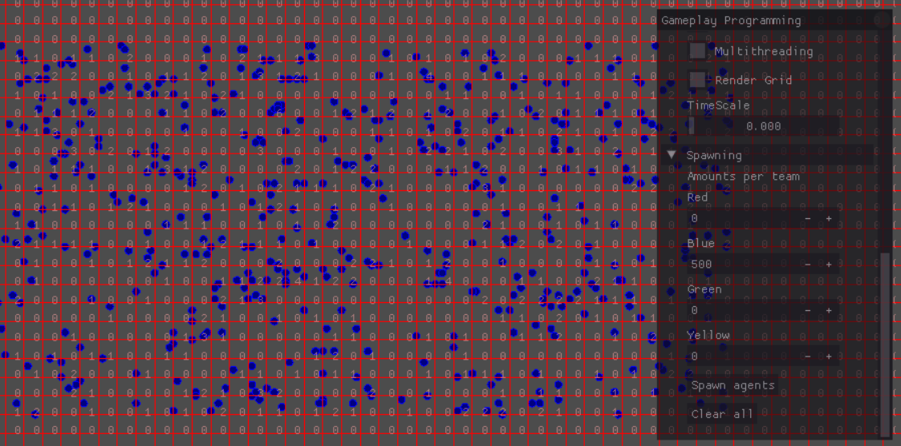

# Optimizing Battle Simulators  
  
  

## Introduction  
  
This is a small research project on how to optimize a large amount of ai agents in a battle simulator.  
Inspired by the millions of agents that some battle simulators can simulate.  
A good example of this is Ultimate Epic Battle Simulator (https://store.steampowered.com/app/616560/Ultimate_Epic_Battle_Simulator/),  
and its sequel Ultimate Epic Battle Simulator 2 (https://store.steampowered.com/app/1468720/Ultimate_Epic_Battle_Simulator_2/).  
  
There are of course many aspects to making a battle simulator, I will try to cover most of the important ones and implement some of them in a small battle simulator application.  

There is an insane amount of depth to this, since almost all optimization techniques for games could be applied to a battle simulator. This reseach project won't go as in depth into all these topics as the references I learned from, so I suggest you take a look at the resources I linked at the bottom of this page if you are interested in a specific topic.
  
All the code will be in separate branches depending on what partitioning technique I used, since that made the most difference between implementations. All other things are implemented in all branches.  

If you want to run the code you need to make sure you download the external dependencies and add them to the same path the folder with the source code is in.
  
  
  
  
  
## Base Application  
  
So, for our own battle simulator that we'll be using to test some optimization techniques, we'll be working in c++ (since it's fast) and using a framework that has a camera, UI and allows us to draw. It also has some basic structs like vector2. We won't be using any in-built physics systems or ai pathfinding since those can be very expensive and I want to explore all the important aspects of optimizing a battle simulator.  
  
We have an agent, every frame, it will try to find the closest enemy target, then calculate the velocity (which will be a vector towards the target), and moves according to that velocity, when it is in attack range, it will stop moving and try to attack.  
  
Our agent will have a simple health component, that we use to do all the health calculations and it tells us when we're dead. It will also have a melee attack component, which we use to attack other agents.  
  
  
Since this is a battle simulator there will be lots of agents dying and spawning. Constantly deallocating and reallocating memory for these agents would be very expensive, so we will eb using an object pool. This means we will allocate a lot of agents at the start of the application and set their state to disabled, and when we want to spawn an agent, we will find a disabled agent and enable it. Whenever an agent dies we will disable it.  
We hold these agents in two separate vectors, since we don't want to loop over all the disabled agents every frame. This way the size of our initial pool won't impact our runtime speed. It will still impact the startup time of the application.  
  
There are two more disadvantages:  
- There might be a lot more memory used by the application than what is actually necessary, or there might not be enough memory allocated and our pool overflows. That   last one can be fixed by detecting when the pool will overflow and then create more agents during runtime.  
- We need to be careful and make sure when we disable an agent, that everything is properly reset, so nothing is remembered and carried over to the next life of the agent  

In our main application, I added a few options to be able to test everything, you can spawn agents by clicking a button, which will spawn agents according to the values you put in.  
You can also spawn agents by dragging the mouse, after selecting a team by pressing the number keys.  
You can delete agents by pressing backspace or the clear agents button in the UI.  
There is also a timescale slider to speed up or slow down the simulator.  
And there are some more settings that will be explained further in this readme.  
  
  
  
  
  
  
## Multithreading  
  
One of the most efficient ways of optimizing any application is using more than one thread of your cpu. The idea is that you run tasks on multiple threads simultaneously. This can multiply the speed of an applications by a lot, depending on how many cores your cpu has.  
We will use multithreading on the biggest bottleneck of the battlesimulator, updating agents. This is relatively easy since we are already doing this in a for loop, we can use concurrency::parallel_for.  
Since multiple threads are accessing some of the same resources, there are some issues that emerge.  
A first issue is with the way we are disabling our agents, we can't delete our agents from the vector we are looping over so we are instead adding their index to a list of indexes of agents that need to be removed. After the agents are updated, this list is looped over and we remove the according agents.  
Using multithreading you need to make sure you don't resize a vector during a parallel thread, because resizing might make the vector relocate to a different part of memory, that the other threads don't know about. Since we are doing a pushback and this can cause a vector to resize when it's size would be bigger than the capacity, we need to fix this. Luckily this is easily done by reserving enough size to the vector before starting the parallel threads. This does use more memory than necessary in most cases since there is the possibility that all agents will be disabled, so the reserve should reserve memory enough for all the enabled agents. An added benefit is that it should be faster when disabling many agents at once since there won't be constant resizing. But in all other cases there is memory 'wasted'.  
Another issue happens with the way we are removing agents.  
We remove agents by replacing the agent with the last agent of the vector, and then remove the last agent, this is faster than removing an agent from the middle of a vector, since all subsequent elements would have to be moved. Using a list, this would not be the case, but since we need to constantly access our agents the constant lookup time of a vector is preferred.  
This means we have to start with the highest index of agents that need to be disabled and end with the first one. Otherwise we might be disabling the wrong agents.  
For example we have 10 enabled agents, we need to disable agent 0, 5 and 9. doing this from 0 to 9 happens like this:  
(read agent[n] as agent at index n)  
start with 0, 1, 2, 3, 4, 5, 6, 7, 8, 9  
agent[0] is swapped with 9  
9, 1, 2, 3, 4, 5, 6, 7, 8, 0  
agent[9] is deleted  
9, 1, 2, 3, 4, 5, 6, 7, 8, null  
agent[5] is swapped with 8  
9, 1, 2, 3, 4, 8, 6, 7, 5, null  
agent[8] is deleted  
9, 1, 2, 3, 4, 8, 6, 7, null, null  
agent[9] is swapped with 7  
9, 1, 2, 3, 4, 8, 6, null, null, 7  
agent[7] is deleted  
9, 1, 2, 3, 4, 8, 6, null, null, 7  
so 9 did not get deleted, and 7 got put after where the vector ends.  
  
if we sort the list of agent indexes to be removed: (9,5,0)  
start with 0, 1, 2, 3, 4, 5, 6, 7, 8, 9  
agent[9] is swapped with 9  
0, 1, 2, 3, 4, 5, 6, 7, 8, 9  
agent[9] is deleted  
0, 1, 2, 3, 4, 5, 6, 7, 8, null  
agent[5] is swapped with 8  
0, 1, 2, 3, 4, 8, 6, 7, 5, null  
agent[8] is deleted  
0, 1, 2, 3, 4, 8, 6, 7, null, null  
agent[0] is swapped with 7  
7, 1, 2, 3, 4, 8, 6, 0, null, null  
agent[7] is deleted  
7, 1, 2, 3, 4, 8, 6, null, null, null  
our final enabled agents are 1, 2, 3, 4, 6, 7 and 8  
this is what we want.  

This issue can be fixed by sorting the list after updating the agents.  
There are multiple sorting algorithms.  
I tested std::qsort, std::sort and std::stableSort. They all didn't impact the framerate at all, probably because the list to sort usually isn't that big.  

There are some more issues that will emerge later on when we use partitioning, but I'll explain them at the appropriate time.  

It is important to also mention the gpu here. Gpus also use parallelism, but they have many more cores compared to a cpu, and also more threads per core. This allows them to run code a lot faster than a cpu, they are however more limited in memory.  
Commercial battle simulators (like UEBS 2) are often running a lot of code on the gpu which drastically improves performance and allows for many more agents to be simulated. It is however a lot more complicated than cpu programming, so I won't implement it in this project.  

Note that the way I implement multithreading here is not fully optimal, since as you can see on this image, the cpu is still not 100% utilized. There are also other cool things you can do with multithreading.  
  
  
  
  
  
  
## Partitioning  
  
One of the biggest bottlenecks in our simulator is still finding the closest target for each of our agents, we are checking all of the enabled agents in every agent update, which means increasing the amount of agents exponentially increases the time spent searching for the closest target.  
A solution would be to make sure the agents only check agents that are reasonably close to them. How can we know which agents should be checked? By using partitioning.  
Partitioning is a design pattern used to divide up agents into different 'groups' so we can check if that group is close enough, and only then check all the agents inside. This pattern is often used for collision detection, where we store points in the partitions. It is also used to find nearest neighbors, which is very close to what we want to do.  
There are many different kinds of partitioning. The simplest is using a grid to divide the world in many cells, each cell represents a group of agents.  
I will first explain how I implemented gridpartitioning.  
  
  
  
#### Simple grid partitioning  
We have a grid class and a cell class.  
The grid contains a vector of cells, it also contains functions to get specific cells (based on position and row/column).  
A cell contains a vector that holds the agents in that cell.  

Our agent now also holds a pointer to the cell it is currently in. To make sure the cells have the correct agents inside, we will need to check every frame, for every agent, if the cell at the agent's position is still the same cell as last frame, if it changed we have to update the current cell in the agent and add the agent to the new cell and remove it from the old cell.  

This works perfectly, you can see it in action by ticking the 'render grid' option in the UI of the application.  
But there is an issue when we do this while multithreading. While we are finding a target in a cell in one thread, another might be modifying that same cell's vector of agents, this causes issues since we might be removing from a vector while looping over it. To fix this we need to update the agents' cells in a synchronous for loop after the normal update. This will make the multithreading a lot less efficient because we need to loop over our agents twice, but it's still a good solution. Another solution would be buffering the agents in every cell. So instead of modifying the active vector of agents when removing or adding agents, we would do it on a separate vector, and then update the active vector based on the modified one after looping over our agents. That way we will need a lot more memory and won't necessarily be faster since updating the vector would happen twice (on the buffer, and after that on the active vector).  

Next up, finding the cells that we need to check.  
Usually with partitioning, only the same cell as the agent is checked, or the surrounding cells in a certain radius. In our case however, it depends on where our agent isq relative to the closest target. The target might be in the same cell, in which case we only need to check that one, but it could also be in the furthest place possible, in which case we need to check all cells. For this implementation, we first check our own cell, then the cells surrounding our own cell, and then increase the range at which we search for a target as long as we haven't found one yet. This method won't be perfectly accurate, but the inaccuracy is barely noticable and performance is heavily improved.  
  
  
  
#### Own experimentation  
I also made a variant of the simple grid partitioning where I tried to improve performance even more.  
All agents in a cell, will generally have to look through the agents of the same cell to find a target, so my idea was to instead loop over every cell and find the closest cell with enemy agents for each team. Then, when finding a target for an agent, only loop over the agents in the closest cell of our own cell according to the team we are in. This way, we don't have to find the closest cell for every agent.  
After implementing this you can see that the agent update is using almost no cpu time, it is all moved to the cell update.
This technique gives a performance boost when there are not that many cells. but when there are more cells, it actually decreases performance since it has to loop over all the cells every frame.  
  
  
  
#### Quad tree partitioning  
A quad tree is a data structure where there is a root, this root has four (quad) children, every child node can have children of their own, which in turn have children. A child node can also be a leaf, which means it doesn't have any children but instead contains data (in our case a vector of agents).  
This structure can be used for partitioning instead of a grid. The biggest advantage is when agents are very close to eachother, and only occupy a small part of the world, since with a quad tree, there will be more nodes (comparable to cells) where there are many agents, and less where there are few. This makes looking for other agents a lot faster, but adding and removing agents from a node will be a lot slower because a node might need to subdivide into more nodes when there are too many agents, or it might need to merge with other children when there are too few agents.  
The architecture is still quite simple since there is only the need for one class, a quadTreeNode class, since the root, leaves and children are basically the same.  
They have the option of having four child nodes, or a vector of agents.  

Inserting and removing in a quad tree happens relatively similar to a grid. An important difference is that removing and adding needs to start from the root, so that all nodes can have their agent counts updated. They all need an agent count to know whether they need to absorb their children.  
When we start from the root we will have to check in which child our agent is, and then call add or remove on that child. This is repeated until we are in a node without children, then we do the operation on this node.  

Finding the closest target can be more difficult, since we can't just look at the bordering cells because there might be 10 bordering cells on the left, and 1 at the top, we can't know. Luckily there are algorithms that are developed for this. I made my own interpretation of how I understand these algorithms work.  
We first check the node that our agent is in, we go as deep as possible, and try to find a target. When we find a target, we store this as the current closest target. Then we go on and check other nodes. To avoid going through all nodes and all agents, we first check if a node is worth visiting by checking if the closest position within the bounds of that node is closer to our agent than the current closest target. If this is the case there is a chance that a closer target is within this node.  
  
  
  
#### Conclusion:  
Overall, grid partitioning is the easiest to implement and has almost the same performance when units are spread out. But when units are closer together quad tree partitioning should be more efficient since it divides those cells with many agents into smaller ones. However I wasn't able to replicate this, since the quad tree goes much deeper when agents are close together, performance actually decreases very quickly. Maybe a different target finding algorithm would give different results?
Or perhaps on bigger world sizes a quad tree will be more performant?
Doing the target finding partly in the cells gives a significant boost to performance, but this technique can probably be improved a lot when explored further. Maybe it can even be combined with a quad tree instead of grid?  
  
  
  
  
  
  
## Agent Size  
  
An interesting topic when using partitioning is agent size, what happens when very large agents exist along very small agents.  
First of all you would have to subtract the radiuses of the agents from the distance when looking for a target.  
Secondly, we are currently looking for a target based on the one cell an agent is in. But what if an agent is so big, it is located in multiple cells?  
If we take the center of the agent to determine which cell an agent is in, our target finding might find a smaller agent first because it is checking a closer cell, and then we determine the other cells aren't worth checking since they are further away. But if a large agent is present, it might actually be closer if you use the radius to compare. To fix this, you would have to store all the cells an agent is in, which might be very expensive since you need to keep track of all those cells, and then every frame you need to check for all of those cells if you are still in them all, and if you entered some other cell or not. You would probably only do these calculations for big agents, because they are not necessary for smaller ones.  
  
  
  
  
  
  
## Crowd Simulation  
  
Another important aspect to a battle simulator is how you make agents act realistically like they are individuals, but also make them share information between each other to increase performance or increase realism.  
These can be simple behaviors like flocking, which involves a combination of separation, cohesion and alignment to make agents behave like a flock of animals. This is still very realistic for humans as well. I've implemented separation in this battle simulator, it is a simple yet effective way to make agents spread out and try to surround the enemy. It also makes a group of agents not all go to the exact same position and look like just one agent.  
You can also add more behaviors, like a way to measure agent morale, and based on that morale, the agent would charge towards the enemy, or maybe even flee if it's too low. Morale could also be shared between agents that are near eachother.  
An implementation of crowd simulation that could increase performance would be flow fields. A flow field divides the world into a grid, and adds a direction to every cell. when an agent enters a cell, they would be directed towards that direction. This creates a nice flow of agents.  
Flow fields could be generated at the start of the application to run almost without a cost (if you have a grid for partitioning already). But in the case of an evolving battlefield (like in a battle simulator), it would need to be generated dynamically. This means you would generate it based on where large amounts of agents are. However this could cause issues if there are agents that stray away from their group, since they might not be targeted by anyone. So you would probably lower the influence the flow field has on the direction of the agent.You would also have to consider the impact on performance the flow field has, and decide whether it's worth it or not.  

Crowd simulation is also often described as a way to graphically represent a crowd, regarding animations for example.  
There are some instancing techniques like skinned instancing that allow you to use the same data for many animated agents.  
  
  
  
  
  
  
## Physics/Collision  
  
Physics are also important in battle simulators, since you don't want agents moving through eachother, or maybe you even want some other physics like ragdolls (like in TABS). For making physics optimized, pratitioning is again important, so you don't check for every collider if it collides with any collider anywhere. It is mostly the same as what I've already covered, so I won't go to deep into how to do it here.  
For my implementation, I just added some simple logic that uses the neighbors we already calculated and then checks if the agents are colliding (which is just a distance check since all agents are circles). If they are, we apply a force opposite to the direction towards this neighbor (similar to separation) with a magnitude equal to the velocity so that we make sure it nullifies the velocity if that velocity was in the direction towards the neighbor, resulting in no movement.  
This does make the agents shake when they are surrounded by too many other agents cause they will collide with multiple agents and get pushed to one side, and the next frame to the other.

The separation option also controls if collision is enabled or not, since not doing both, means we can skip finding neighbors, and measure only our target finding speeds.  
  
  
  
  
  
  
## Pathfinding
I did not implement any pathfinding in this battle simulator, but will talk about it here.
Pathfinding would be necessary when you want the battle to take place anywhere other than an open field, so this could be a castle, or a field with forests, big rock formations, cliffs...
The simplest way to implement pathfinding would be using the A* algorithm, this algorithm finds the shortest path from one node in a graph to another. This could be applied to our battle simulator using the grid and quad tree that we use when partitioning. Every cell could be marked as obstacle or not, so if there is an obstacle inside the cell, agents will avoid it. You could also mark a cell as obstacle when it contains a certain amount of agents, this would make other agents avoid places where there are already many agents.
There would need to be some adaptations to the grid/tree, since every cell needs to know its neighboring cells. With simple grid partitioning this would be simple, since the grid is static, we could just set the neighbors of a cell in each cell at the start of the application.
With quad partitioning this would be more tricky, since it can change throughout the simulation, which means the neighboring nodes would change aswell. One node could also theoretically have hundreds of neighboring nodes if it's a big node, neighboring many smaller ones, however that last bit shouldn't be an issue for the algorithm.
So to check which nodes are neighbors in a quad tree, you would loop over all nodes, for every node, and check if any borders are shared, if there are, it is a neighbor.
This would be very inefficient though. A way to optimize this would be to only recalculate neighbors whenever you split a node, or combine one. And only check it for the node that was split/combined and all its old neighbors.

Using a good heuristic with A* is also very important. Without heuristic, A* is the same as dijkstra's algorithm, and it will look in all directions for the shortest path. A heuristic leads the algorithm towards the goal destination, to avoid checking paths that aren't going to be the shortest anyway.

Another way to do pathfinding and make the agents act more realistic as a bonus, is by using ant colony optimization (ACO).
ACO is inspired by how real ants find solutions to problems, like finding a shortest path. The idea is that there are many "ants", in our case agents, that move randomly towards their goal, while on their way, they leave behind information that indicates how efficient their path is. The next agents can then decide which way to go based on this information, until they are all taking the shortest path.
You would have to put a timer on how long the information should stay relevant to make sure it works in a dynamic environment like a battle simulator.  

When using flow fields for crowd simulation, the flow fields could also be used for pathfinding. But then you would have to add another flow field that contains information on where obstacles are and combine it with the dynamic one that is used for crowd simulation.
  
  
  
  
  
  
## Performance Tests Analysis
  
#### Introduction:
After finishing the application, I did some additional tests to try and find which techniques made the most impact on performance. I also wanted to find the most performant combination for different situations.
The purpose of these measurements isn’t to get super accurate results, so there’s a pretty big error margin since I didn’t spend time doing multiple measurements to get more accurate results.
  
I measured the different partitioning techniques in different situations, as well as measuring how much of an effect multithreading and separation had on the fps.
I defined 4 different benchmarks for agent counts:  
B1: 500 agents in every team  
B2: 1000 agents in every team  
B3: 3000 agents in every team  
B4: 6000 agents in every team  
(There are four teams)  
Each partitioning technique was tested with various densities, which means different grid sizes for grid partitioning and different maximum agent counts per node with the quad tree.
I also made a distinction between the start of the simulation and while agents are in combat.
There is a difference since at the start, agents are spread out. While during combat, they are much closer together, especially when separation is disabled.
All measurements during combat were taken ten seconds after spawning the agents.

After all those tests I did a few extra ones:
- 20 000 vs 20 000 agents, to test the limits
- B3 test, but with double the world size, to test the impact of a bigger world
  
  
#### Analysis:
First of all, it’s obvious that without optimizations, the battle simulator runs quite poorly.
With a low count of agents it actually still runs fine, but fps very quickly goes down when more agents are on the battlefield. This is an indicator that performance exponentially decreases.
Performance is also better during combat, since agents start dying very quickly, which reduces the amount that have to be updated.
Image 1  
This stays the same when using multithreading, but overall performance is increased.
Image 2  
When using separation, performance stays the same during combat, since it takes longer for them to find a target, because they can’t move through each other.
Image 3  

For grid partitioning without multithreading or separation, we can see a notable increase in performance when there are many agents, similar to what multithreading did.
There is also quite a big difference when using different grid sizes. At the start of the simulation, the 100x100 grid performs a lot worse compared to the others. But during combat it actually performs the best.
Image, Image  
This stays true when using multithreading and separation

Similar results can be found when doing target acquisition in the grid.
But the overall performance is increased, especially with a higher number of agents. This means that our target finding is becoming less exponential.
Image, Image  
Note that when using multithreading and a 100x100 grid, the performance with just a grid is identical to doing target finding in the grid. I have no idea why but it is worth mentioning.

For the Quad tree implementation, we can see overall improved results over the grid, but not when we compare it to the grid with target finding done in the grid.
This is mostly since performance goes down during combat, when agents get bunched up together.
This is contrary to what I expected, since a quad tree is supposed to perform better when agents are less spread across the world.
Image, Image  

Increasing world size seems to increase the performance on average as well, but it’s not consistent and the difference is also not a lot. But experimenting with different sizes can definitely have some impact on framerate.
Image  
  
  
#### Conclusion:
When we enable multithreading and separation, and compare every partitioning technique during combat, we can see that the quad tree and grid partitioning are a big improvement compared to using no partitioning. A grid seems best for a lower amount of agents, and a quad tree performs better for a higher amount of agents.
Using a grid and doing target finding in the grid seems to be the best performing technique overall.
Image  
This trend continues even when using a very large number of agents.
Image  
  
  
  
  
  
  
## Known Issues:
When agents are outside the world bounds in any partitioning application, they will be counted as part of the closest cell/node. This will result in inaccurate target/neighbor finding.  
Agents won't always go to the closest target with partitioning, this is more prevalent when target acquisition is done in the cells.  
Low fps and/or high timescale will cause agents to be shot away from eachother.  
Agents will overlap when in combat even when separation is on.  
  
  
  
  
  
  
## Future Work:  
There are definitely a lot more improvements that can be made. Like using the gpu for updating agents, implementing better collision algorithms or using more realistic crowd simulation algorithms.  
Another way of finding targets could be implemented by using dynamic flow fields, that direct agents towards eachother based on where they are located. There would need to be different flow fields for every team, and dynamically generating a flow field might be expensive. This would have to be tested.  

There are also probably a lot of inefficiencies that I'm doing since I'm not an expert programmer by far. I definitely learned a lot though and will probably do some follow-up research when I find the time.  

I also talked about some concepts (like flow fields) but didn't implement them, so my assumptions might be wrong. I definitely wnat to try and implement them in the future though.  
  
  
  
  
  
  
## Sources
  
#### Games that gave me inspiration:  
https://store.steampowered.com/app/616560/Ultimate_Epic_Battle_Simulator/  
https://store.steampowered.com/app/1468720/Ultimate_Epic_Battle_Simulator_2/  
  
  
#### Cool videos:  
https://www.youtube.com/watch?v=2qfkEUV1w1I  
https://www.youtube.com/watch?v=kpojDPlIjdQ  
  
  
#### Object pooling:  
http://gameprogrammingpatterns.com/object-pool.html  
  
  
#### GPU multithreading:  
https://www.pgroup.com/blogs/posts/cuda-threading-model.htm  
  
  
#### Partitioning:  
https://gameprogrammingpatterns.com/spatial-partition.html  
http://homepage.divms.uiowa.edu/~kvaradar/sp2012/daa/ann.pdf  
  
  
#### Crowd simulation:  
http://www.gameaipro.com/GameAIPro/GameAIPro_Chapter23_Crowd_Pathfinding_and_Steering_Using_Flow_Field_Tiles.pdf  
https://en.wikipedia.org/wiki/Crowd_simulation  
##### Graphical:  
https://developer.download.nvidia.com/SDK/10/direct3d/Source/SkinnedInstancing/doc/SkinnedInstancingWhitePaper.pdf  
  
  
#### Pathfinding:  
https://www.redblobgames.com/pathfinding/a-star/introduction.html  
http://www.scholarpedia.org/article/Ant_colony_optimization  
